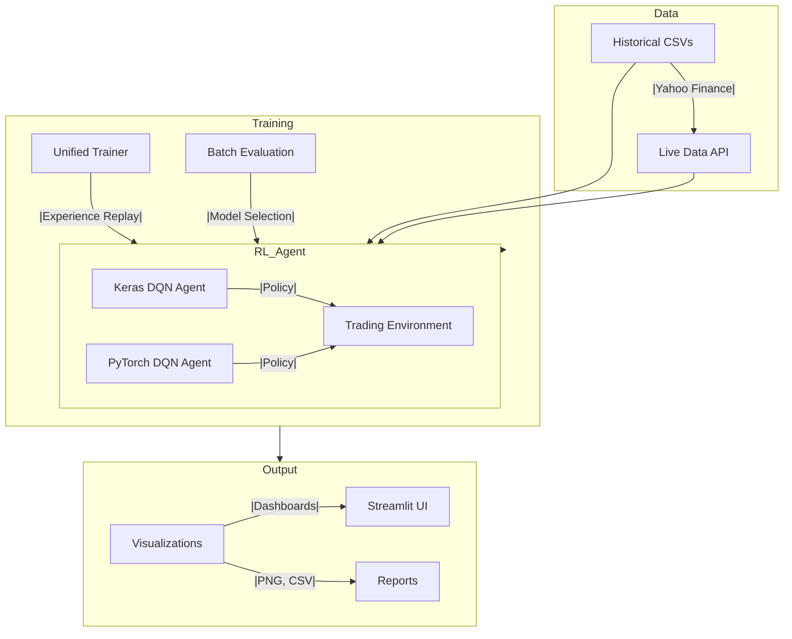

<!-- PROJECT LOGO -->
<p align="center">
  " alt="Q-Trader Logo" width="120" height="120">
</p>

<h1 align="center">Q-Trader: State-of-the-Art Deep RL Stock Trading Framework</h1>

<p align="center">
  <b>Unified, Modular, Research-Grade Reinforcement Learning for Financial Markets</b><br>
  <a href="#">  </a>
  <a href="#">  </a>
  <a href="#">  </a>
  <a href="#">  </a>
  <a href="#">  </a>
  <a href="#">  </a>
</p>

---

##  Table of Contents
- [Overview](#overview)
- [Key Features](#key-features)
- [Architecture](#architecture)
- [Project Structure](#project-structure)
- [Installation](#installation)
- [Quick Start](#quick-start)
- [Advanced Usage](#advanced-usage)
- [Visualizations & Dashboard](#visualizations--dashboard)
- [Configuration](#configuration)
- [Extensibility](#extensibility)
- [Research Context](#research-context)
- [Citation](#citation)
- [Contributing](#contributing)
- [License](#license)
- [Acknowledgments](#acknowledgments)

---

##  Overview
Q-Trader is a **state-of-the-art Deep Q-Network (DQN) reinforcement learning framework** for algorithmic stock trading. Designed for both academic research and real-world deployment, it supports **interday and intraday strategies**, multi-backend (Keras/TensorFlow & PyTorch), unified training/evaluation, brokerage simulation, and beautiful dashboarding. The agent learns adaptive, policy-based trading strategies that generalize across assets and market regimes.

---

##  Key Features
- **Unified RL Framework**: Interday (daily) and intraday (minute-level) trading in one codebase
- **Multi-Backend**: Seamless Keras (TensorFlow) and PyTorch agent support
- **Modular & Extensible**: Plug-and-play agents, environments, and reward functions
- **Unified Training/Evaluation**: One script for end-to-end RL workflow (with/without brokerage charges)
- **Batch & Ensemble Evaluation**: Evaluate all models, select best by profit or Sharpe
- **Brokerage Simulation**: Realistic trading with Groww API and brokerage cost modeling
- **Live Data & Backtesting**: Yahoo Finance integration, live and historical data
- **Streamlit Dashboard**: Interactive web UI for recommendations and backtesting
- **Beautiful Visualizations**: Portfolio, actions, profit, buy-and-hold, and more
- **Production-Ready**: Configurable, scalable, and lightweight for deployment
- **Research-Grade**: Reproducible, well-documented, and easy to extend

---

##  Architecture



---

##  Project Structure

| Path/Script                        | Purpose                                                                 |
|-------------------------------------|-------------------------------------------------------------------------|
| `agent/agent.py`                   | Keras DQN agent (core logic, training, action selection)                |
| `agent/agent_torch.py`             | PyTorch DQN agent                                                       |
| `functions.py`                     | Data preprocessing, state construction, reward computation              |
| `train.py`                         | Train Keras agent on interday data                                      |
| `evaluate.py`                      | Evaluate Keras agent on interday data                                   |
| `train_inter.py`                   | Interday-specific Keras training                                        |
| `evaluate_inter.py`                | Interday-specific Keras evaluation                                      |
| `train_intra.py`                   | Train Keras agent on intraday (5-min) data                              |
| `evaluate_intra.py`                | Evaluate Keras agent on intraday data                                   |
| `train_intra_torch.py`             | Train PyTorch agent on intraday data                                    |
| `evaluate_intra_torch.py`          | Evaluate PyTorch agent on intraday data                                 |
| `train_intra_torch2.py`            | Advanced PyTorch intraday training (ensemble, boosting, etc.)           |
| `evaluate_intra_torch2.py`         | Advanced PyTorch intraday evaluation                                    |
| `evaluate_intra_torch2_all.py`     | Batch evaluation of all PyTorch models                                  |
| `evaluate_all_inter.py`            | Batch evaluation of all interday models                                 |
| `evaluate_all_intra.py`            | Batch evaluation of all intraday models                                 |
| `evaluate_intra_limit.py`          | Intraday evaluation with portfolio/trade limits                         |
| `unified_train_eval.py`            | Unified PyTorch training & evaluation (single script)                   |
| `unified_train_eval_with_charges.py`| Unified training/evaluation with Groww brokerage charges                |
| `InterDay/app.py`                  | Streamlit dashboard for live recommendations and backtesting            |
| `Miscalaneous/`                    | Utility scripts, plotting, notebooks                                    |
| `models/`                          | Saved model checkpoints (.keras, .pt, .pth)                             |
| `visuals/`                         | Generated trading dashboards and plots                                  |
| `data/`                            | Example datasets (CSV, Numbers)                                         |
| `groww_config_template.json`        | Template for Groww API credentials/config                               |

---

##  Installation

```bash
git clone https://github.com/yourusername/q-trader.git
cd q-trader
pip install -r requirements.txt
# Or manually:
pip install tensorflow torch numpy matplotlib pandas yfinance streamlit
```

---

##  Quick Start

### Interday (Daily) Mode
```bash
python train.py [stock.csv] [window_size] [episodes]
python evaluate.py [stock.csv] [model_name]
```

### Intraday (5-min) Mode
```bash
python train_intra.py
python evaluate_intra.py
```

### PyTorch Intraday (Advanced)
```bash
python train_intra_torch.py
python train_intra_torch2.py
python evaluate_intra_torch.py
python evaluate_intra_torch2.py
python evaluate_intra_torch2_all.py
```

### Unified Training & Evaluation
```bash
python unified_train_eval.py
python unified_train_eval_with_charges.py --train-date YYYY-MM-DD --eval-date YYYY-MM-DD --include-charges
```

### Streamlit Dashboard
```bash
cd InterDay
streamlit run app.py
```

---

##  Advanced Usage
- **Batch Evaluation**: `evaluate_all_inter.py`, `evaluate_all_intra.py`, `evaluate_intra_torch2_all.py`
- **Portfolio/Trade Limits**: `evaluate_intra_limit.py`
- **Custom Data**: Place your CSVs in `data/` or use Yahoo tickers
- **Model Selection**: Choose best model by profit, Sharpe, or custom metric
- **Brokerage Simulation**: Use `--include-charges` for realistic cost modeling
- **Live Trading Ready**: Configure `groww_config.json` for Groww API
- **Ensemble/Boosting**: Advanced PyTorch scripts for model ensembles
- **Notebook Prototyping**: See `Miscalaneous/` for Jupyter/Colab notebooks

---

##  Visualizations & Dashboard
- **Trading Actions**: Buy/Sell actions on price chart
- **Portfolio Value**: Agent’s portfolio value over time
- **Cumulative Profit**: Accumulated profit during trading
- **Buy-and-Hold Comparison**: Model vs. passive strategy
- **Combined Dashboards**: All metrics in a single view
- **Streamlit UI**: Live recommendations, backtesting, and analytics

All outputs are saved in `visuals/`.

---

##  Configuration
- **Groww API**: Copy `groww_config_template.json` to `groww_config.json` and fill in credentials
- **Data**: Place your CSVs in `data/` or use Yahoo tickers
- **Models**: Saved in `models/` after training
- **Parameters**: Tune window size, episodes, batch size, etc. in scripts or via CLI

---

##  Extensibility
- **Add New Agents**: Implement new RL agents in `agent/`
- **Custom Environments**: Extend state/reward logic in `functions.py`
- **Plug-in Data Sources**: Add new data loaders for other APIs
- **Metrics & Analytics**: Add new evaluation metrics or visualizations
- **Production Deployment**: Integrate with brokers, cloud, or trading bots

---

##  Research Context
Q-Trader is inspired by the latest research in deep reinforcement learning for finance, including:
- Policy-based and value-based RL for trading
- Experience replay, target networks, and ensemble methods
- Realistic backtesting with slippage and brokerage
- Modular, reproducible RL pipelines for finance

---

##  Citation
If you use Q-Trader in your research, please cite:
```bibtex
@misc{qtrader2024,
  title={Q-Trader: Unified Deep RL Framework for Stock Trading},
  author={Jayaditya Reddy},{Adip Krishna Guduru}
  year={2024},
  howpublished={\url{https://github.com/yourusername/q-trader}}
}
```

---

##  Contributing
Pull requests, issues, and feature suggestions are welcome! Please open an issue to discuss your ideas.

---

##  Acknowledgments
- Inspired by open-source RL trading research
- Uses Yahoo Finance, TensorFlow, PyTorch, Streamlit, and more
- Thanks to the open-source community for foundational libraries


